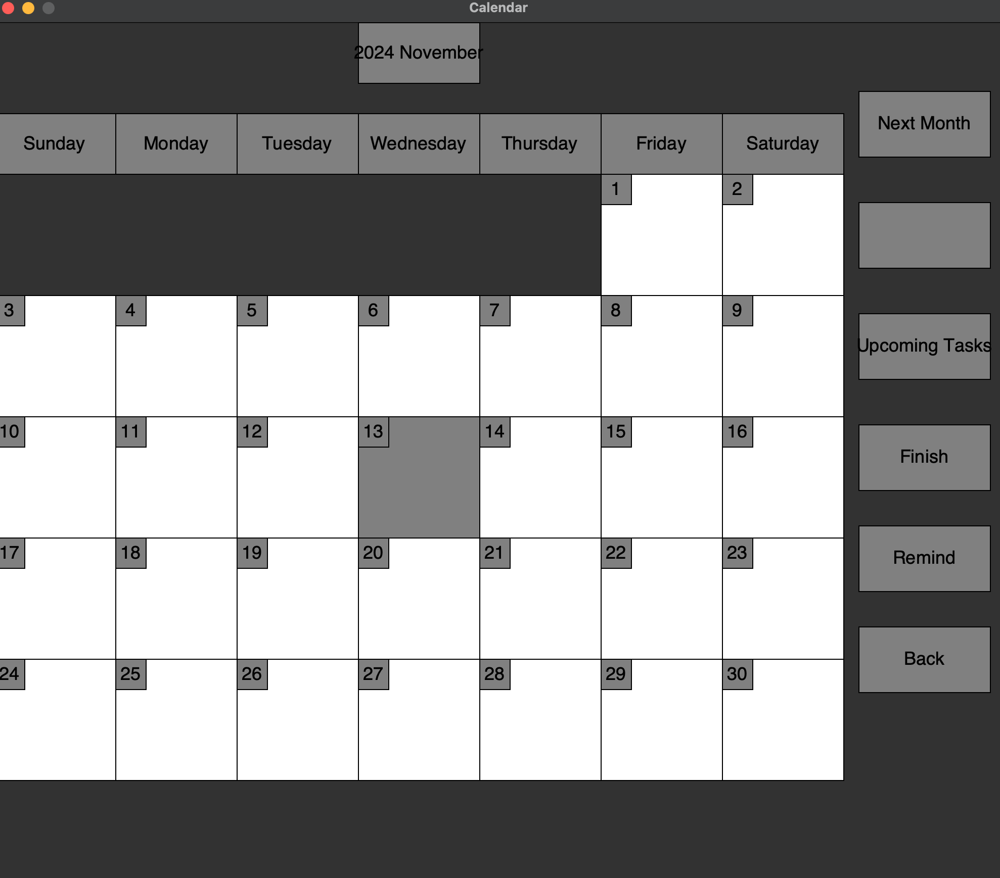

# Reminder
This reminder project was created in 2019 - 2020, aiming to create a calender, allowing the user to create reminders. Once they create a reminder and set it to a future dat, they have to mark it as completed. If the user did not complete the task, the application would annoy the user to do the reminder until they mark it as completed. The reminder finished late would go to the "Wall of Shame". 
